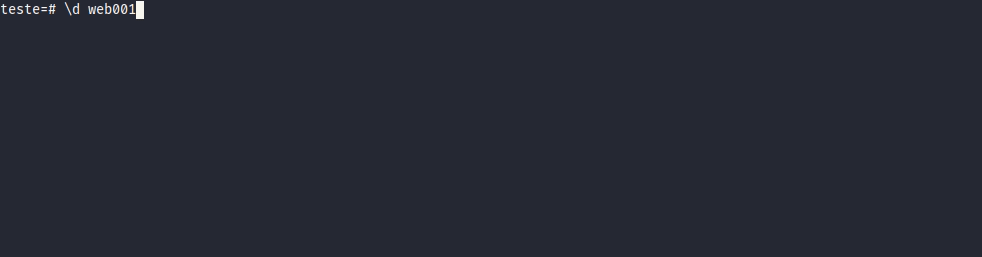

<h1 align="center">

</h1>

<h2 align="center">
  🚀 Automatizando tarefas com PostgresSQL
</h2>

  

  
  
  

  

  

  <a href="#octocat-projeto">Projeto</a>&nbsp;&nbsp;&nbsp;|&nbsp;&nbsp;&nbsp;
  <a href="#recycle-atualiza%C3%A7%C3%A3o">Atualização</a>&nbsp;&nbsp;&nbsp;|&nbsp;&nbsp;&nbsp;
  <a href="#bookmark_tabs-funcionalidades">Funcionalidades</a>&nbsp;&nbsp;&nbsp;|&nbsp;&nbsp;&nbsp;  
  <a href="#rocket-detalhes">Detalhes</a>&nbsp;&nbsp;&nbsp;|&nbsp;&nbsp;&nbsp;
  <a href="#memo-licença">Licença</a>

## :octocat: Projeto
Esse repositório visa registar funcionalidades (funções/triggers/views..etc) que automatizam as tarefas realizadas no dia-a-dia. Apesar de ser focado em Postgres, as funcionalidades também podem ser aplicadas em outros bancos de dados, pois tem como base SQL e pgplsql.

## :recycle: Atualização
Atualização contínua, sempre que possível será adicionado novas funcionalidades.

## :bookmark_tabs: Funcionalidades

<a href="#01---gerar-insert-com-select-excluindo-o-campo-serial">01 - Gerar INSERT com SELECT excluindo o campo serial</a> 
<a href="#">02 - EM DESENVOLVIMENTO....</a>

## :rocket: Detalhes

### 01 - Gerar INSERT com SELECT excluindo o campo serial
Em tabelas com vários campos, gerar manualmente torna-se muito trabalhoso. Com essa função basta informar a tabela.

<a href="https://github.com/andersonheinz/postgresql-automatizando-tarefas/blob/master/functions/generate_insert_values_without_nextval.sql">Ir para o código</a>

## :memo: Licença

Esse projeto está sob a licença MIT. Veja o arquivo [LICENSE](LICENSE) para mais detalhes.

